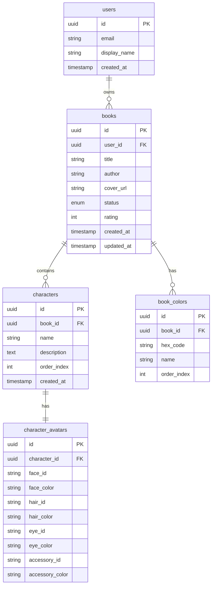

# BookKit - Project Documentation

## 📚 Overview

**BookKit** is a web application designed to enhance the reading experience by helping users track books, manage character profiles with customizable avatars, and save color palettes associated with each book.

---

## 🛠 Tech Stack

| Layer | Technology |
|-------|------------|
| Framework | Next.js 14 (App Router) |
| Styling | Tailwind CSS |
| Database | Supabase (PostgreSQL) |
| Authentication | Supabase Auth |
| Storage | Supabase Storage (for images) |
| State Management | Zustand or React Context |
| Export | html-to-image / html2canvas |

---

## 📁 Project Structure

```
bookkit/
├── app/
│   ├── (auth)/
│   │   ├── login/
│   │   └── signup/
│   ├── (main)/
│   │   ├── books/
│   │   │   ├── page.tsx              # Book list
│   │   │   └── [bookId]/
│   │   │       ├── page.tsx          # Book detail
│   │   │       └── characters/
│   │   │           └── [characterId]/
│   │   │               └── page.tsx  # Character editor
│   │   └── layout.tsx
│   ├── api/
│   ├── layout.tsx
│   └── page.tsx                      # Landing/redirect
├── components/
│   ├── ui/                           # Reusable UI components
│   ├── book/
│   │   ├── BookCard.tsx
│   │   ├── BookForm.tsx
│   │   └── BookCover.tsx
│   ├── character/
│   │   ├── CharacterCard.tsx
│   │   ├── CharacterSticker.tsx
│   │   └── AvatarBuilder/
│   │       ├── index.tsx
│   │       ├── FaceSelector.tsx
│   │       ├── HairSelector.tsx
│   │       ├── EyeSelector.tsx
│   │       ├── AccessorySelector.tsx
│   │       └── ColorPicker.tsx
│   └── palette/
│       ├── ColorPalette.tsx
│       └── ColorSwatch.tsx
├── lib/
│   ├── supabase/
│   │   ├── client.ts
│   │   ├── server.ts
│   │   └── middleware.ts
│   └── utils/
│       ├── colors.ts
│       └── export.ts
├── hooks/
│   ├── useBooks.ts
│   ├── useCharacters.ts
│   └── usePalette.ts
├── types/
│   └── index.ts
├── public/
│   └── assets/
│       └── avatar/
│           ├── faces/
│           ├── hair/
│           ├── eyes/
│           └── accessories/
└── styles/
    └── globals.css
```

---

## 🗄 Database Schema

### ERD Diagram



### SQL Migrations

```sql
-- Enable UUID extension
CREATE EXTENSION IF NOT EXISTS "uuid-ossp";

-- ENUM for book status
CREATE TYPE book_status AS ENUM ('to_read', 'reading', 'completed', 'dropped');

-- Users table (extends Supabase auth.users)
CREATE TABLE public.users (
    id UUID PRIMARY KEY REFERENCES auth.users(id) ON DELETE CASCADE,
    email TEXT NOT NULL,
    display_name TEXT,
    created_at TIMESTAMPTZ DEFAULT NOW()
);

-- Books table
CREATE TABLE public.books (
    id UUID PRIMARY KEY DEFAULT uuid_generate_v4(),
    user_id UUID NOT NULL REFERENCES public.users(id) ON DELETE CASCADE,
    title TEXT NOT NULL,
    author TEXT,
    cover_url TEXT,
    status book_status DEFAULT 'to_read',
    rating INTEGER CHECK (rating >= 0 AND rating <= 5),
    created_at TIMESTAMPTZ DEFAULT NOW(),
    updated_at TIMESTAMPTZ DEFAULT NOW()
);

-- Characters table
CREATE TABLE public.characters (
    id UUID PRIMARY KEY DEFAULT uuid_generate_v4(),
    book_id UUID NOT NULL REFERENCES public.books(id) ON DELETE CASCADE,
    name TEXT NOT NULL,
    description TEXT,
    order_index INTEGER DEFAULT 0,
    created_at TIMESTAMPTZ DEFAULT NOW()
);

-- Character avatars table
CREATE TABLE public.character_avatars (
    id UUID PRIMARY KEY DEFAULT uuid_generate_v4(),
    character_id UUID UNIQUE NOT NULL REFERENCES public.characters(id) ON DELETE CASCADE,
    face_id TEXT DEFAULT 'face_01',
    face_color TEXT DEFAULT '#FFE0BD',
    hair_id TEXT DEFAULT 'hair_01',
    hair_color TEXT DEFAULT '#4A3728',
    eye_id TEXT DEFAULT 'eye_01',
    eye_color TEXT DEFAULT '#634E34',
    accessory_id TEXT,
    accessory_color TEXT
);

-- Book colors table
CREATE TABLE public.book_colors (
    id UUID PRIMARY KEY DEFAULT uuid_generate_v4(),
    book_id UUID NOT NULL REFERENCES public.books(id) ON DELETE CASCADE,
    hex_code TEXT NOT NULL,
    name TEXT,
    order_index INTEGER DEFAULT 0
);

-- Indexes for performance
CREATE INDEX idx_books_user_id ON public.books(user_id);
CREATE INDEX idx_characters_book_id ON public.characters(book_id);
CREATE INDEX idx_book_colors_book_id ON public.book_colors(book_id);

-- Row Level Security (RLS)
ALTER TABLE public.users ENABLE ROW LEVEL SECURITY;
ALTER TABLE public.books ENABLE ROW LEVEL SECURITY;
ALTER TABLE public.characters ENABLE ROW LEVEL SECURITY;
ALTER TABLE public.character_avatars ENABLE ROW LEVEL SECURITY;
ALTER TABLE public.book_colors ENABLE ROW LEVEL SECURITY;

-- RLS Policies
CREATE POLICY "Users can view own profile" ON public.users
    FOR SELECT USING (auth.uid() = id);

CREATE POLICY "Users can update own profile" ON public.users
    FOR UPDATE USING (auth.uid() = id);

CREATE POLICY "Users can manage own books" ON public.books
    FOR ALL USING (auth.uid() = user_id);

CREATE POLICY "Users can manage characters in own books" ON public.characters
    FOR ALL USING (
        book_id IN (SELECT id FROM public.books WHERE user_id = auth.uid())
    );

CREATE POLICY "Users can manage avatars for own characters" ON public.character_avatars
    FOR ALL USING (
        character_id IN (
            SELECT c.id FROM public.characters c
            JOIN public.books b ON c.book_id = b.id
            WHERE b.user_id = auth.uid()
        )
    );

CREATE POLICY "Users can manage colors in own books" ON public.book_colors
    FOR ALL USING (
        book_id IN (SELECT id FROM public.books WHERE user_id = auth.uid())
    );
```

---

## 📋 TypeScript Types

```typescript
// types/index.ts

export type BookStatus = 'to_read' | 'reading' | 'completed' | 'dropped';

export interface User {
  id: string;
  email: string;
  display_name: string | null;
  created_at: string;
}

export interface Book {
  id: string;
  user_id: string;
  title: string;
  author: string | null;
  cover_url: string | null;
  status: BookStatus;
  rating: number | null;
  created_at: string;
  updated_at: string;
}

export interface Character {
  id: string;
  book_id: string;
  name: string;
  description: string | null;
  order_index: number;
  created_at: string;
  avatar?: CharacterAvatar;
}

export interface CharacterAvatar {
  id: string;
  character_id: string;
  face_id: string;
  face_color: string;
  hair_id: string;
  hair_color: string;
  eye_id: string;
  eye_color: string;
  accessory_id: string | null;
  accessory_color: string | null;
}

export interface BookColor {
  id: string;
  book_id: string;
  hex_code: string;
  name: string | null;
  order_index: number;
}

// Avatar asset types
export interface AvatarAsset {
  id: string;
  name: string;
  src: string;
  category: 'face' | 'hair' | 'eye' | 'accessory';
}

export interface AvatarConfig {
  face: { id: string; color: string };
  hair: { id: string; color: string };
  eye: { id: string; color: string };
  accessory: { id: string | null; color: string | null };
}
```

---

## 🎨 Feature Specifications

### 1. Book Management

#### Book List Page (`/books`)
| Element | Description |
|---------|-------------|
| Book cards | Grid display of all user's books |
| Add button | Opens modal to create new book |
| Filter | Filter by status (reading, completed, etc.) |
| Search | Search by title or author |

#### Book Detail Page (`/books/[bookId]`)
| Section | Features |
|---------|----------|
| Header | Cover image, title, author, status badge |
| Rating | 5-star clickable rating |
| Color Palette | Swatches with click-to-copy |
| Characters | Sticker-style character cards |

### 2. Color Palette System

```typescript
// components/palette/ColorSwatch.tsx

interface ColorSwatchProps {
  color: BookColor;
  onCopy: (hex: string) => void;
  onDelete?: (id: string) => void;
}

// Features:
// - Click to copy hex code to clipboard
// - Show toast notification on copy
// - Optional delete button on hover
// - Color name tooltip
```

**Interaction Flow:**
```mermaid
flowchart LR
    A[User clicks swatch] --> B[Copy hex to clipboard]
    B --> C[Show toast: "Copied #HEXCODE"]
    C --> D[Toast auto-dismisses]
```

### 3. Character Avatar Builder

#### Avatar Asset Structure
```
public/assets/avatar/
├── faces/
│   ├── face_01.svg
│   ├── face_02.svg
│   └── ...
├── hair/
│   ├── hair_01.svg    # Short
│   ├── hair_02.svg    # Long
│   ├── hair_03.svg    # Curly
│   ├── hair_04.svg    # Ponytail
│   ├── hair_05.svg    # Braids
│   └── ...
├── eyes/
│   ├── eye_01.svg
│   ├── eye_02.svg
│   └── ...
└── accessories/
    ├── acc_01.svg     # Glasses
    ├── acc_02.svg     # Hat
    └── ...
```

#### Avatar Builder Component Structure

```typescript
// components/character/AvatarBuilder/index.tsx

interface AvatarBuilderProps {
  character: Character;
  onSave: (avatar: AvatarConfig) => void;
  onExport: () => void;
}

// Tabs/Categories:
// 1. Face - Shape and skin color
// 2. Hair - Style and color
// 3. Eyes - Style and color
// 4. Accessories - Optional items
```

#### Default Color Palettes

```typescript
// lib/utils/colors.ts

export const SKIN_COLORS = [
  '#FFDBAC', '#F5C99D', '#E8B98A', '#D4A574',
  '#C18E5B', '#A67449', '#8B5D3B', '#6B4423',
];

export const HAIR_COLORS = [
  '#F5E6C8', '#E6C07B', '#D4A76A', '#8B6914',  // Blonde/Light
  '#704214', '#4A3728', '#2C1810', '#1A0F0A',  // Brown/Black
  '#B8312F', '#FF6B6B', '#9B59B6', '#3498DB',  // Fantasy colors
];

export const EYE_COLORS = [
  '#634E34', '#2E536F', '#3D671D', '#497665',
  '#7B3F00', '#000000', '#9B59B6', '#E74C3C',
];
```

### 4. Character Sticker Export

```typescript
// lib/utils/export.ts

import { toPng } from 'html-to-image';

export async function exportCharacterAsPng(
  elementRef: HTMLElement,
  characterName: string
): Promise<void> {
  const dataUrl = await toPng(elementRef, {
    backgroundColor: 'transparent',
    pixelRatio: 2, // High resolution
  });

  // Create download link
  const link = document.createElement('a');
  link.download = `${characterName}-sticker.png`;
  link.href = dataUrl;
  link.click();
}

// Drag-and-drop handler for external use
export function handleDragStart(
  event: DragEvent,
  imageDataUrl: string
): void {
  event.dataTransfer?.setData('text/uri-list', imageDataUrl);
  event.dataTransfer?.setData('text/plain', imageDataUrl);
}
```

---

## 🖼 UI Components

### Book Card

```typescript
// components/book/BookCard.tsx

interface BookCardProps {
  book: Book;
  onClick: () => void;
}

// Visual specs:
// - Aspect ratio: 2:3 (book cover style)
// - Hover: Slight scale up (1.02) + shadow
// - Status badge: Top right corner
// - Rating: Bottom, star icons
```

### Character Sticker Card

```typescript
// components/character/CharacterSticker.tsx

interface CharacterStickerProps {
  character: Character;
  onClick: () => void;
  onDragStart: (e: DragEvent) => void;
  draggable?: boolean;
}

// Visual specs:
// - Avatar preview (composed SVG layers)
// - Name label below avatar
// - Draggable for PNG export
// - Click to edit
```

### Avatar Preview

```typescript
// components/character/AvatarBuilder/AvatarPreview.tsx

interface AvatarPreviewProps {
  config: AvatarConfig;
  size?: 'sm' | 'md' | 'lg';
  ref?: RefObject<HTMLDivElement>; // For export
}

// Renders layered SVGs:
// Layer order (bottom to top):
// 1. Face (base)
// 2. Hair (back layer if applicable)
// 3. Eyes
// 4. Hair (front layer)
// 5. Accessories
```

---

## 🔄 API Routes & Data Flow

### Supabase Client Setup

```typescript
// lib/supabase/client.ts
import { createBrowserClient } from '@supabase/ssr';

export function createClient() {
  return createBrowserClient(
    process.env.NEXT_PUBLIC_SUPABASE_URL!,
    process.env.NEXT_PUBLIC_SUPABASE_ANON_KEY!
  );
}
```

### Custom Hooks

```typescript
// hooks/useCharacters.ts

export function useCharacters(bookId: string) {
  const [characters, setCharacters] = useState<Character[]>([]);
  const [loading, setLoading] = useState(true);
  const supabase = createClient();

  // Fetch characters with avatars
  async function fetchCharacters() {
    const { data, error } = await supabase
      .from('characters')
      .select(`
        *,
        avatar:character_avatars(*)
      `)
      .eq('book_id', bookId)
      .order('order_index');

    if (data) setCharacters(data);
    setLoading(false);
  }

  // Create character
  async function createCharacter(name: string) { /* ... */ }

  // Update avatar
  async function updateAvatar(
    characterId: string,
    config: AvatarConfig
  ) { /* ... */ }

  // Delete character
  async function deleteCharacter(id: string) { /* ... */ }

  return {
    characters,
    loading,
    createCharacter,
    updateAvatar,
    deleteCharacter,
    refetch: fetchCharacters,
  };
}
```

---

## 📱 Page Wireframes

### Book Detail Page
```
┌─────────────────────────────────────┐
│  ← Back                             │
├─────────────────────────────────────┤
│  ┌─────────┐                        │
│  │  Cover  │  Title                 │
│  │  Image  │  Author                │
│  │         │  Status: ●Reading      │
│  └─────────┘  ★★★★☆                 │
├─────────────────────────────────────┤
│  Color Palette              [+ Add] │
│  ○ ○ ○ ○ ○ ○ ○ ○                    │
├─────────────────────────────────────┤
│  Characters                 [+ Add] │
│  ┌────┐ ┌────┐ ┌────┐ ┌────┐       │
│  │ 👤 │ │ 👤 │ │ 👤 │ │ 👤 │       │
│  │name│ │name│ │name│ │name│       │
│  └────┘ └────┘ └────┘ └────┘       │
└─────────────────────────────────────┘
```

### Character Editor Page
```
┌─────────────────────────────────────┐
│  ← Back              Character Name │
├─────────────────────────────────────┤
│           ┌─────────────┐           │
│           │             │           │
│           │   Avatar    │           │
│           │   Preview   │           │
│           │             │           │
│           └─────────────┘           │
├─────────────────────────────────────┤
│  [Face] [Hair] [Eyes] [Accessories] │
├─────────────────────────────────────┤
│  Style:                             │
│  ○ ○ ○ ○ ○ ○ ○ ○                    │
│                                     │
│  Color:                             │
│  ● ● ● ● ● ● ● ●                    │
│  ● ● ● ● ● ● ● ●                    │
├─────────────────────────────────────┤
│        [Save]  [Export PNG]         │
└─────────────────────────────────────┘
```

---

## ⚙️ Environment Variables

```env
# .env.local

# Supabase
NEXT_PUBLIC_SUPABASE_URL=your_supabase_project_url
NEXT_PUBLIC_SUPABASE_ANON_KEY=your_supabase_anon_key
SUPABASE_SERVICE_ROLE_KEY=your_service_role_key

# Optional: Analytics
NEXT_PUBLIC_ANALYTICS_ID=your_analytics_id
```

---

## 📦 Dependencies

```json
{
  "dependencies": {
    "next": "^14.0.0",
    "react": "^18.2.0",
    "react-dom": "^18.2.0",
    "@supabase/supabase-js": "^2.39.0",
    "@supabase/ssr": "^0.1.0",
    "html-to-image": "^1.11.0",
    "zustand": "^4.4.0",
    "sonner": "^1.3.0",
    "lucide-react": "^0.300.0",
    "clsx": "^2.0.0",
    "tailwind-merge": "^2.2.0"
  },
  "devDependencies": {
    "typescript": "^5.3.0",
    "tailwindcss": "^3.4.0",
    "postcss": "^8.4.0",
    "autoprefixer": "^10.4.0",
    "@types/react": "^18.2.0",
    "@types/node": "^20.10.0",
    "eslint": "^8.55.0",
    "eslint-config-next": "^14.0.0"
  }
}
```

---

## ✅ Implementation Checklist

### Phase 1: Foundation
- [ ] Initialize Next.js project with TypeScript
- [ ] Configure Tailwind CSS
- [ ] Set up Supabase project and database schema
- [ ] Implement authentication (login/signup)
- [ ] Create base UI components

### Phase 2: Book Management
- [ ] Book list page with grid view
- [ ] Book creation modal/form
- [ ] Book detail page layout
- [ ] Book status and rating functionality
- [ ] Book cover image upload

### Phase 3: Color Palette
- [ ] Color swatch component
- [ ] Click-to-copy functionality with toast
- [ ] Add/remove colors
- [ ] Color picker integration

### Phase 4: Character System
- [ ] Character card component
- [ ] Character creation form
- [ ] Avatar preview component
- [ ] Layered SVG rendering

### Phase 5: Avatar Builder
- [ ] Create SVG avatar assets (faces, hair, eyes, accessories)
- [ ] Category tabs navigation
- [ ] Style selector grid
- [ ] Color picker for each category
- [ ] Real-time preview updates
- [ ] Save avatar configuration

### Phase 6: Export Features
- [ ] PNG export functionality
- [ ] Drag-and-drop support
- [ ] High-resolution export option

### Phase 7: Polish
- [ ] Responsive design optimization
- [ ] Loading states and skeletons
- [ ] Error handling
- [ ] Empty states
- [ ] Animations and transitions

---

## 🎨 Design Tokens

```css
/* Suggested color palette for the app itself */

:root {
  /* Primary */
  --color-primary: #6366F1;      /* Indigo */
  --color-primary-dark: #4F46E5;
  
  /* Neutral */
  --color-bg: #FAFAFA;
  --color-card: #FFFFFF;
  --color-border: #E5E7EB;
  
  /* Text */
  --color-text: #1F2937;
  --color-text-muted: #6B7280;
  
  /* Status */
  --color-reading: #F59E0B;      /* Amber */
  --color-completed: #10B981;    /* Green */
  --color-to-read: #6366F1;      /* Indigo */
  --color-dropped: #EF4444;      /* Red */
}
```

---

## 📝 Notes for Developer

1. **Avatar SVGs**: All avatar parts should be created as SVG with fill colors that can be dynamically changed via CSS or inline styles. Use `currentColor` or data attributes for colorizable elements.

2. **Performance**: Use `React.memo` for character stickers and color swatches since there can be many on a single page.

3. **Image Optimization**: Use Next.js `<Image>` component for book covers. Store covers in Supabase Storage with size limits.

4. **Accessibility**: Ensure color swatches have proper contrast labels and keyboard navigation works in the avatar builder.

5. **Mobile Experience**: The avatar builder should work well on touch devices with larger tap targets for color/style selection.
